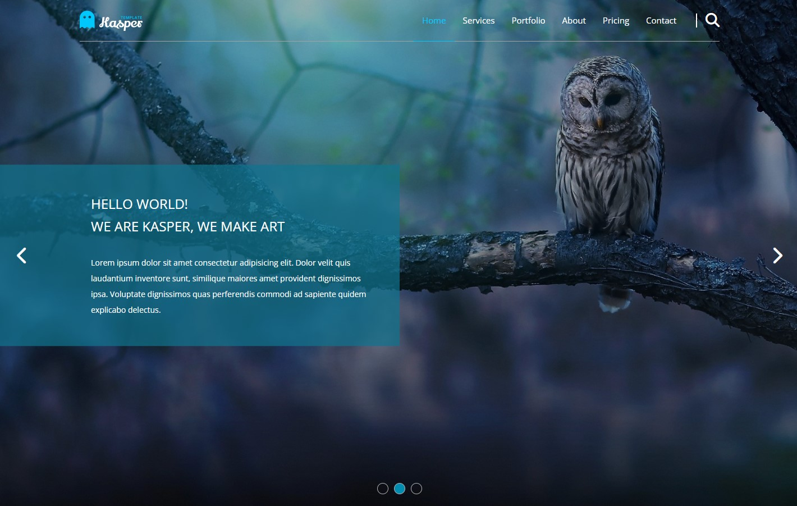
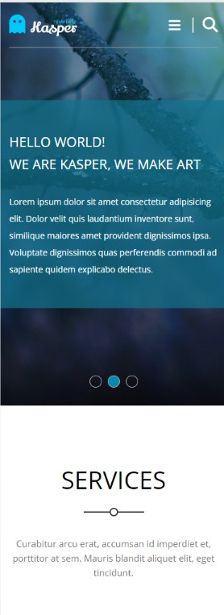

# Kasper - One Page Creative PSD Template

This is coding for the free [Kasper - One Page Creative PSD Template
on Graphberry.com](https://www.graphberry.com/item/kasper-one-page-psd-template). 

## Table of contents

- [Overview](#overview)
  - [The template](#the-template)
  - [Screenshot](#screenshot)
  - [Links](#links)
- [My process](#my-process)
  - [Built with](#built-with)
  - [What I learned](#what-i-learned)
  - [Continued development](#continued-development)
- [Author](#author)

## Overview

### The template

Kasper is creative one page PSD template great for portfolio,agency or any other web page.PSD file is fully layered and grouped.Free google font used.Help file included with links to font and images.Note* Images are not included in psd file.

### Screenshot

"Click for full Image"
"Click for full Image"

### Links

- Repo URL: [Repo URL](https://github.com/YahiaG/Kasper---One-Page-Creative-design)
- Live Site URL: [Live Site URL](https://yahiag.github.io/Kasper---One-Page-Creative-design/)

## My process

### Built with

- Semantic HTML5 markup
- CSS custom properties
- Flexbox
- CSS Grid
- Mobile-first workflow

## Author

- Frontend Mentor - [@Yahia Ali](https://www.frontendmentor.io/profile/YahiaG)
- LinkedIn - [Yahia Ali](https://www.linkedin.com/in/Yahia-Ali22)

## Acknowledgments

If I should tip my hat for someone in this field, this one will absolutely be [Osama Elzero](https://elzero.org/), I'm so grateful to him for all the Good courses he presents to all for free.

> من علمني حرفاً صنت له عهداً, حفظت له وداً